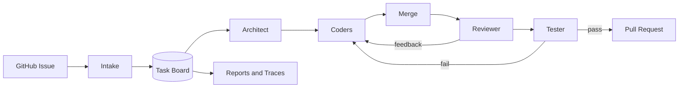

# Multi-Agent Software Engineering Team

Autonomous issue-to-PR orchestration for AI software engineering workflows.

[](https://github.com/ramshetty01/multiagent-software-team/actions/workflows/ci.yml)

## Why This Exists

Single-agent coding loops collapse when one context has to hold issue context,
repo architecture, multiple implementation branches, review feedback, test logs,
and cost accounting. This project splits the workflow into explicit roles:

- architect: converts a GitHub issue into a subtask DAG
- coders: claim subtasks and work in isolated worktrees/sandboxes
- merge coordinator: stages branches and records conflicts
- reviewer: reviews the merged diff only
- tester: verifies in a clean environment and stores artifacts
- reporter: exports cost, trace, benchmark, and handoff-failure summaries

## Current Status

This repository is a production-oriented scaffold. It includes the core
contracts, adapters, runners, CLI commands, tests, and deployment skeleton, but
it is not yet a published benchmark result. Live autonomous runs require real
provider credentials and a sandbox backend.

## Features

- GitHub issue ingestion through `gh`
- Append-only JSONL task board with worker leases
- Config-driven provider factory for Anthropic, OpenAI, Gemini, and local fake providers
- Local, Docker, and Daytona runner interfaces
- Worktree lifecycle manager
- Scope guard for coder patches
- Staging merge coordinator and conflict resolver hook
- Reviewer and tester model adapters
- Artifact store, status summaries, preflight diagnostics, and schema export
- Cost accounting, tracing fallback, benchmark report structures
- Kubernetes starter manifests and Dockerfile

## Install

```sh
python3 -m venv .venv
. .venv/bin/activate
python3 -m pip install -e .
scripts/self_check.py
```

## Quick Start

Run local diagnostics:

```sh
mast preflight --repo .
```

Export the message schema:

```sh
mast schema
```

Run a local dry issue intake flow:

```sh
mast run --issue ramshetty01/multiagent-software-team#97 --run-id demo --board /tmp/mast-board.jsonl --artifact-dir /tmp/mast-artifacts
mast status --board /tmp/mast-board.jsonl --run-id demo
```

## Configuration

Local mode uses fake providers. Production mode requires provider credentials:

```sh
cp .env.example .env
```

Required production variables:

- `GITHUB_TOKEN`
- `ANTHROPIC_API_KEY`
- `OPENAI_API_KEY`
- `GOOGLE_API_KEY`
- `LANGFUSE_PUBLIC_KEY`
- `LANGFUSE_SECRET_KEY`

See [docs/configuration.md](docs/configuration.md).

## Architecture



Detailed docs:

- [Architecture](docs/architecture.md)
- [Run lifecycle](docs/run-lifecycle.md)
- [Operator setup](docs/operator-setup.md)
- [Benchmarks and evaluation](docs/benchmarks.md)
- [Troubleshooting](docs/troubleshooting.md)

## Evaluation

The repository includes evaluation structures and a placeholder 50-issue file.
Real SWE-bench Pro scoring requires licensed issue IDs and live model execution.
The required protocol and artifact contract are documented in
[docs/benchmarks.md](docs/benchmarks.md).

Tracked metrics:

- pass@1
- single-agent baseline pass@1
- wall-clock speedup
- token and dollar cost by role
- reviewer false-approval rate
- handoff-failure histogram

## Security

This project executes untrusted repository code. Treat all target repositories
as hostile unless explicitly allowlisted. Use Docker or Daytona isolation for
production runs. See [docs/threat-model.md](docs/threat-model.md).

## Limitations

- No published SWE-bench Pro score yet.
- Live model tests are not run in default CI.
- Kubernetes manifests are starter manifests, not a validated production cluster.
- The default JSONL task board is intended for local and small-scale runs.
- Provider prompts and schemas are still evolving.

## Roadmap

- Publish a real E2E demo run.
- Replace placeholder benchmark issue IDs with licensed SWE-bench Pro IDs.
- Add full LangGraph checkpoint persistence.
- Add live-provider integration test suite behind explicit environment gates.
- Add docs site and benchmark report.

## License

License is tracked in [LICENSE](LICENSE).
