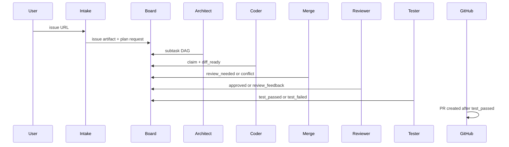
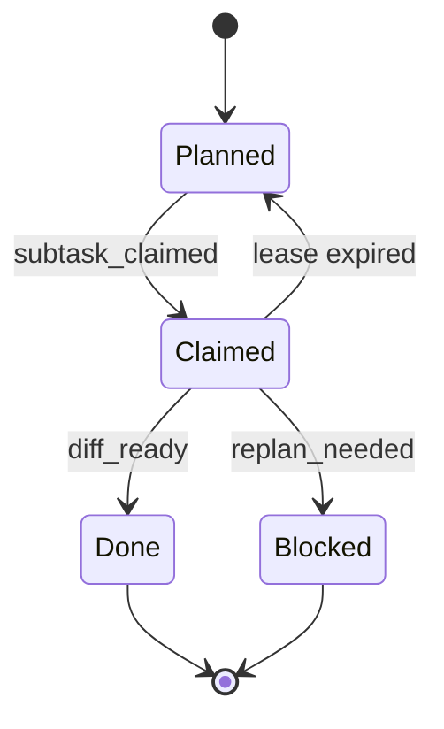
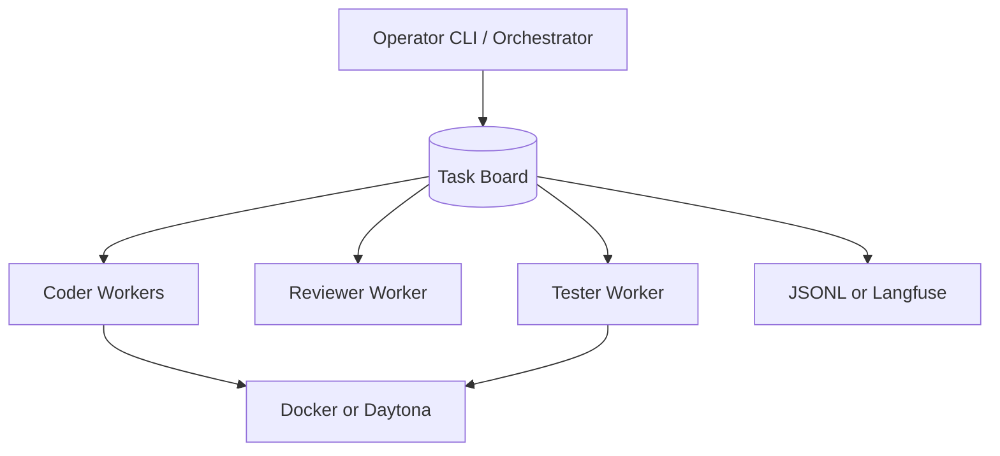

# Diagrams

## Role Sequence

```mermaid
sequenceDiagram
  participant User
  participant Intake
  participant Board
  participant Architect
  participant Coder
  participant Merge
  participant Reviewer
  participant Tester
  participant GitHub

  User->>Intake: issue URL
  Intake->>Board: issue artifact + plan request
  Architect->>Board: subtask DAG
  Coder->>Board: claim + diff_ready
  Merge->>Board: review_needed or conflict
  Reviewer->>Board: approved or review_feedback
  Tester->>Board: test_passed or test_failed
  GitHub->>GitHub: PR created after test_passed
```

## Worker Lease Lifecycle

```mermaid
stateDiagram-v2
  [*] --> Planned
  Planned --> Claimed: subtask_claimed
  Claimed --> Done: diff_ready
  Claimed --> Planned: lease expired
  Claimed --> Blocked: replan_needed
  Done --> [*]
  Blocked --> [*]
```

## Deployment Sketch

```mermaid
flowchart TB
  API[Operator CLI / Orchestrator] --> Board[(Task Board)]
  Board --> CoderPods[Coder Workers]
  Board --> Reviewer[Reviewer Worker]
  Board --> Tester[Tester Worker]
  CoderPods --> Sandbox[Docker or Daytona]
  Tester --> Sandbox
  Board --> Traces[JSONL or Langfuse]
```

